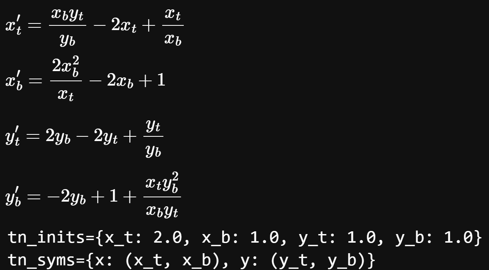
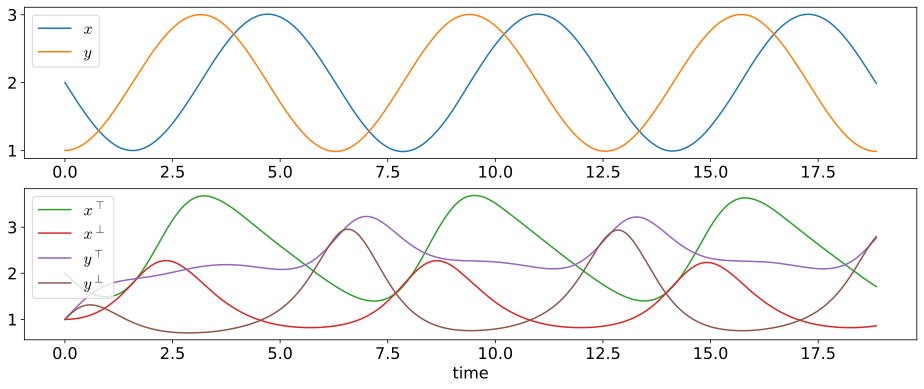

# ode2tn
ode2tn is a Python package to compile arbitrary polynomial ODEs into a transcriptional network simulating the ODEs.

See this paper for details: TODO

## Installation

Type `pip install ode2tn` at the command line.

## Usage

See the [notebook.ipynb](notebook.ipynb) for more examples of usage, including all the examples discussed in the paper.

The functions `ode2tn` and `plot_tn` are the main elements of the package.
`ode2tn` converts a system of arbitrary polynomial ODEs into another system of ODEs representing a transcriptional network as defined in the paper above.
Each variable $x$ in the original ODEs is represented by a pair of variables $x^\top,x^\bot$, whose ratio $\frac{x^\top}{x^\bot}$ follows the same dynamics in the transcriptional network as $x$ does in the original ODEs.
`plot_tn` does this conversion and then plots the ratios by default, although it can be customized what exactly is plotted; 
see the documentation for [gpac.plot](https://gpac.readthedocs.io/en/latest/#gpac.ode.plot) for a description of all options.

Here is a typical way to call each function:

```python
from math import pi
import numpy as np
import sympy as sp
from transform import plot_tn, ode2tn

x,y = sp.symbols('x y')
odes = { # odes dict maps each symbol to an expression for its time derivative
    x: y-2,
    y: -x+2,
}
inits = { # inits maps each symbol to its initial value
    x: 2,
    y: 1,
}
gamma = 2 # uniform decay constant; should be set sufficiently large that ???
beta = 1 # constant introduced to keep values from going to infinity or 0
tn_odes, tn_inits, tn_syms = ode2tn(odes, inits, gamma=gamma, beta=beta)
gp.display_odes(tn_odes)
print(f'{tn_inits=}')
print(f'{tn_syms=}')
```

When run in a Jupyter notebook, this will show



showing that the variables `x` and `y` have been replace by pairs `x_t,x_b` and `y_t,y_b`, whose ratios `x_t/x_b` and `y_t/y_b` will track the values of the original variable `x` and `y` over time.

If not in a Jupyter notebook, one could also inspect the transcriptional network ODEs via
```python
for var, ode in tn_odes.items():
    print(f"{var}' = {ode}")
```
which would print a text-based version of the equations:
```
x_t' = x_b*y_t/y_b - 2*x_t + x_t/x_b
x_b' = 2*x_b**2/x_t - 2*x_b + 1
y_t' = 2*y_b - 2*y_t + y_t/y_b
y_b' = -2*y_b + 1 + x_t*y_b**2/(x_b*y_t)
```

The function `plot_tn` above does this conversion on the *original* odes and then plots the ratios.
Running 

```python
t_eval = np.linspace(0, 6*pi, 1000)
# note below it is odes and inits, not tn_odes and tn_inits
# plot_tn calls ode2tn to convert the ODEs before plotting
plot_tn(odes, inits, gamma=gamma, beta=beta, t_eval=t_eval, show_factors=True)
```

in a Jupyter notebook will show this figure:



The parameter `show_factors` above indicates to show a second subplot with the underlying transcription factors ($x^\top, x^\bot, y^\top, y^\bot$ above).
If left unspecified, it defaults to `False` and plots only the original values (ratios of pairs of transcription factors, $x,y$ above).

One could also hand the transcriptional network ODEs to [gpac](https://github.com/UC-Davis-molecular-computing/gpac) to integrate, if you want to directly access the data being plotted above.
The `OdeResult` object returned by `gpac.integrate_odes` is the same returned by [`scipy.integrate.solve_ivp`](https://docs.scipy.org/doc/scipy/reference/generated/scipy.integrate.solve_ivp.html), where the return value `sol` has a field `sol.y` that has the values of the variables in the order they were inserted into `tn_odes`, which will be the same as the order in which the original variables `x` and `y` were inserted, with `x_t` coming before `x_b`:

```python
t_eval = np.linspace(0, 2*pi, 5)
sol = gp.integrate_odes(tn_odes, tn_inits, t_eval)
print(f'times = {sol.t}')
print(f'x_t   = {sol.y[0]}')
print(f'x_b   = {sol.y[1]}')
print(f'y_t   = {sol.y[2]}')
print(f'y_b   = {sol.y[3]}')
```

which would print

```
times = [0.         1.57079633 3.14159265 4.71238898 6.28318531]
x_t   = [2.         1.78280757 3.67207594 2.80592514 1.71859172]
x_b   = [1.         1.78425369 1.83663725 0.93260227 0.859926  ]
y_t   = [1.         1.87324904 2.14156469 2.10338162 2.74383426]
y_b   = [1.         0.93637933 0.71348949 1.05261915 2.78279691]
```


